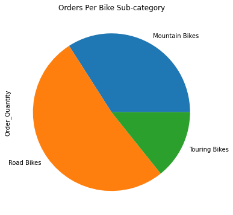
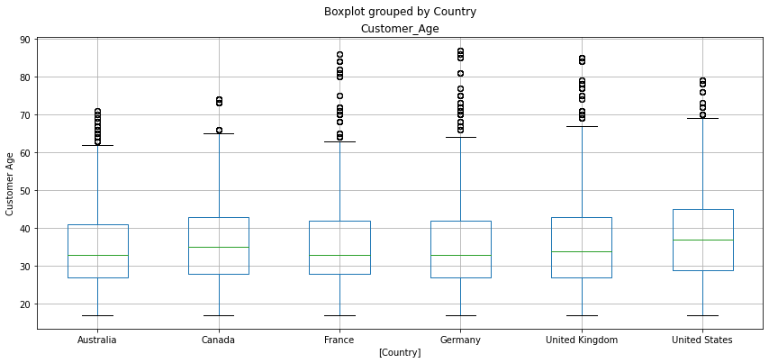

# Analyze Global Bicycle Sales
## A freeCodeCamp project

**Objective:** Using a kaggle dataset with bicycle sales from around the world use python to perform various sales analyses.

Programming languages and libraries used: 
- python
- pandas
- matplotlib

To view the [code](Bike_Store_Project.ipynb) it might be easier to copy the .ipynb file url into [nbviewer](https://nbviewer.jupyter.org/).
